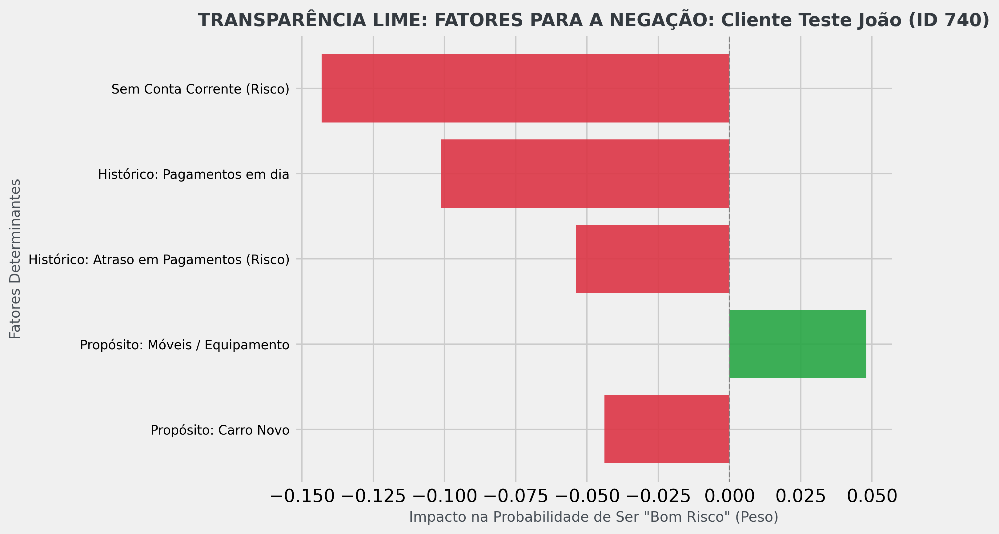
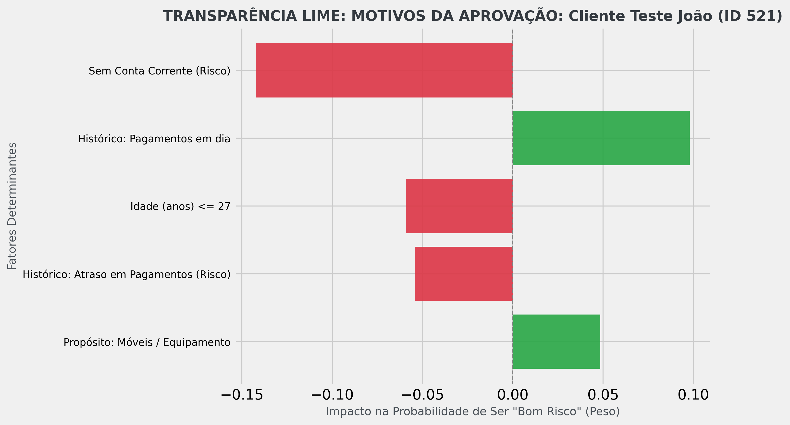

#  📌Decifrando a Caixa Preta:Tornando Modelos de IA Explicáveis com LIME 
- Aplicar técnicas de Explainable AI (XAI)
## 1.Contextualização do Problema e Definição dos Objetivos

### 🎯- Contextualização do Desafio 

Este projeto se concentra em um desafio crucial para as empresas que usam modelos de Machine Learning na avaliação de crédito. Embora os modelos de Machine Learning (ML) atinjam excelentes índices de precisão, eles frequentemente operam como uma "caixa-preta".
Diante disso, clientes, gerentes e órgãos regulatórios passaram a questionar **"por que"** o modelo toma determinadas decisões, com foco especial nos casos de negação de crédito.Exige que a empresa seja capaz de explicar cada decisão individual de forma transparente, clara e tecnicamente fundamentada.

O problema central, é a necessidade de ir além da precisão: o objetivo é transformar um modelo que apenas acerta o resultado em um modelo que também seja explicável e transparente em cada decisão.

### -🚀 Definição dos Objetivos

A missão deste projeto é aplicar técnicas de **Explainable AI (XAI)**, utilizando a biblioteca **LIME** (Local Interpretable Model-agnostic Explanations), para solucionar o problema da opacidade.

Os objetivos específicos são:
1.  **Desenvolver** um modelo de classificação sobre o dataset **Statlog (German Credit Data)**.
2.  **Gerar explicações locais** (LIME) que mostrem quais características do cliente (como histórico de inadimplência, tipo de conta ou idade) mais impactaram na decisão do modelo para clientes analisados.
3.  **Demonstrar a transparência** das decisões do modelo, tanto em casos de **Negação** (Mau Risco) quanto em casos de **Aprovação** (Bom Risco), conforme exigido para fins de compliance e comunicação com o cliente.

### 💭2. Explicação do Modelo Preditivo Escolhido
### - 

Para o desafio de classificar clientes entre "Bom Risco" e "Mau Risco" (classificação binária), foi escolhido o algoritmo de **Random Forest (Floresta Aleatória)**.

#### Por que escolhi o Random Forest?
1.  **Alta Acurácia:** O Random Forest é um modelo de aprendizado de conjunto conhecido por entregar alta acurácia e estabilidade, sendo muito eficaz em problemas de classificação do mundo real, como o credit scoring.
2.  **Robustez:** Ele lida bem com a complexidade e a não-linearidade dos dados de crédito, além de ser menos suscetível a *overfitting* (sobreajuste) em comparação com uma única Árvore de Decisão.
3.  **O Problema da Caixa-Preta:** Apesar de sua excelente performance, o Random Forest opera como um modelo de **"caixa-preta"**. Sua decisão final é o resultado da média de centenas de árvores individuais, o que torna impossível para um ser humano rastrear ou explicar o "porquê" de uma decisão individual.

#### Papel do Modelo no Projeto
O modelo Random Forest serve como a **base preditiva** do projeto. Sua alta precisão valida a utilidade do sistema, enquanto sua opacidade (a "caixa-preta") justifica a necessidade e a aplicação da ferramenta LIME. A explicação do LIME é, portanto, o método de tornar as previsões deste modelo complexo transparentes para o cliente e para fins de auditoria.

### - Discussão Interpretativa sobre as Explicações Geradas pelo LIME

A aplicação do LIME permitiu abrir a "caixa-preta" do modelo Random Forest, fornecendo explicações transparentes para duas decisões críticas: a negação de crédito (ID 740) e a aprovação (ID 521).

#### A. Análise da Negação de Crédito (ID 740)
**GRÁFICO LIME - FATORES PARA A NEGAÇÃO (ID 740):**

No caso do Cliente ID 740, a previsão do modelo foi de **Mau Risco**, levando à negação do crédito. O gráfico LIME revela que o peso total dos fatores negativos (barras vermelhas) superou significativamente o único fator positivo.

* **Fator Principal de Risco:** A falta de conta corrente (**"Sem Conta Corrente (Risco)"**) foi o fator mais impactante para a negação, com um peso negativo de aproximadamente -0.15.
* **Fator Secundário de Risco:** O histórico de crédito do cliente contribuiu de forma crucial. O rótulo **"Histórico: Pagamentos em dia"** aparece na cor vermelha, indicando que a **ausência** dessa característica positiva no perfil do cliente foi um risco, levando a um impacto negativo de cerca de -0.10.
* **Decisão Explicada:** O modelo determinou que o propósito de crédito ("Móveis / Equipamento") não era um fator positivo suficiente para mitigar os altos riscos de falta de conta e problemas de histórico.

#### B. Análise da Aprovação de Crédito (ID 521)

No caso do Cliente ID 521, o modelo previu **Bom Risco** e concedeu o crédito. Este gráfico demonstra a essência do XAI: mesmo um cliente aprovado possui riscos, mas seus pontos fortes foram superiores.

* **Fator Principal de Aprovação:** O **"Histórico: Pagamentos em dia"** foi o fator mais forte e positivo (+0.10), sendo o motor da aprovação.
* **Riscos Mitigados:** Curiosamente, este cliente também apresenta o maior risco do dataset (**"Sem Conta Corrente (Risco)"**). No entanto, a força do seu histórico (Pagamentos em dia) e o Propósito do empréstimo (Móveis/Equipamento) foram suficientes para **mitigar** o risco e pender a balança para a concessão.

#### C. Demonstração de Coerência e Domínio Técnico

A comparação dos dois gráficos valida a coerência e a lógica do modelo Random Forest:

* **Coerência do Modelo:** O LIME prova que o modelo nega o crédito por motivos lógicos (falta de conta e histórico ruim) e aprova por motivos igualmente lógicos (histórico positivo forte).
* **Nuance Técnica (o mesmo rótulo em cores opostas):** A feature **"Histórico: Pagamentos em dia"** é um exemplo perfeito. Ela está em **verde** no caso de **Aprovação** (indicando que a característica *está presente*) e em **vermelho** no caso de **Negação** (indicando que a *ausência* da característica é um fator de risco), provando a capacidade do LIME de extrair o impacto de uma característica em contextos locais diferentes.

